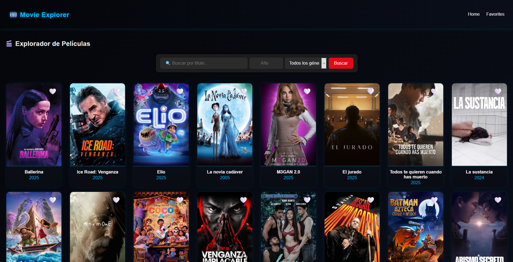
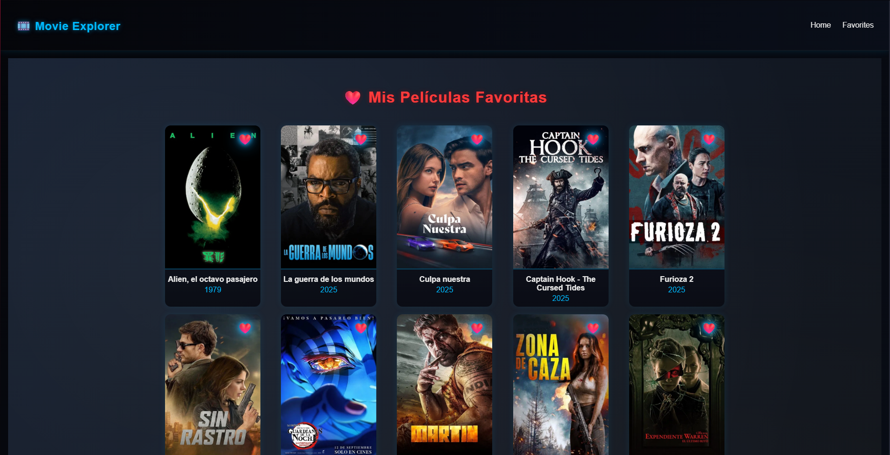
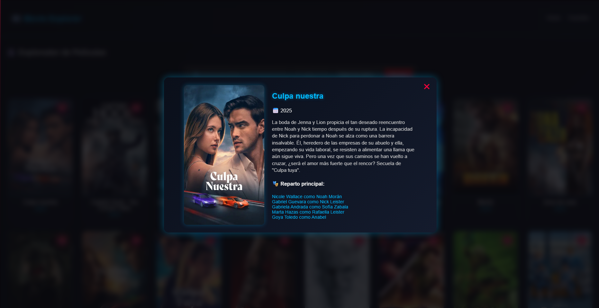
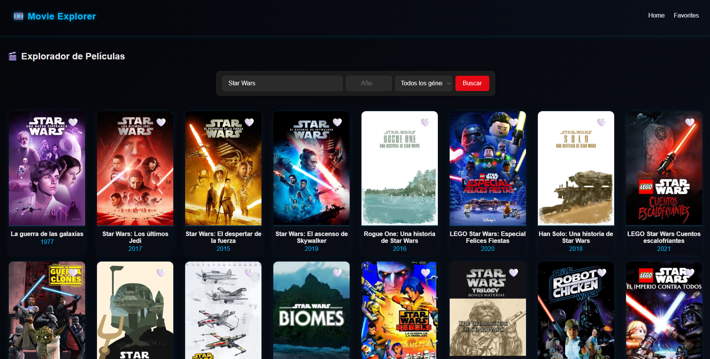
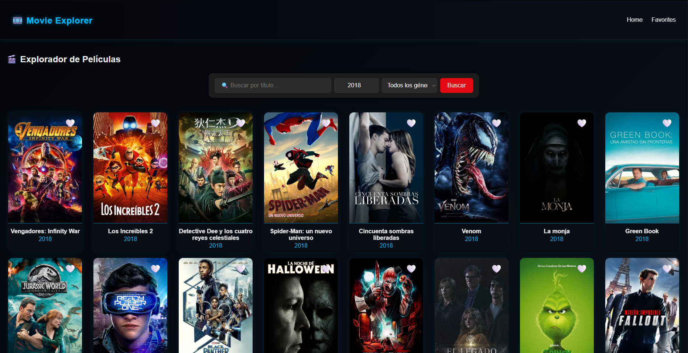
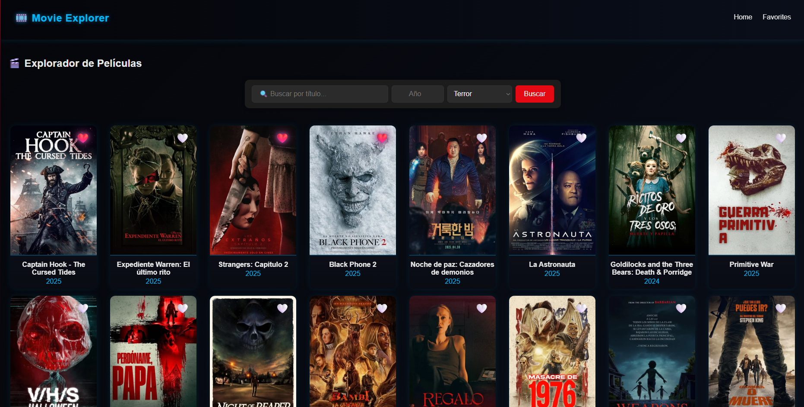

<h1 align="center">🎬 Movie Explorer</h1>
<p align="center">
  <em>Aplicación web interactiva desarrollada con React y Vite para explorar, buscar y guardar películas favoritas utilizando la API de The Movie Database (TMDB).</em>
</p>

<p align="center">
  
  
  
  
  
</p>

---

### 👤 Autor
**Nombre:** _Iván Seco Martín_  
**Asignatura:** Diseño y despliegue de aplicaciones multiplataforma  
**Fecha de entrega:** _2 de noviembre de 2025_
**Fecha de inicio:** _21 de octubre de 2025_  
**Repositorio GitHub:** [Enlace al repositorio](https://github.com/Praisel04/Aplicaciones-Multiplataforma/tree/main/PEC2/movie-explorer)

---

## 🧭 Índice

- [🧭 Índice](#-índice)
- [🪄 Introducción](#-introducción)
- [🎯 Objetivos del proyecto](#-objetivos-del-proyecto)
- [🧱 Estructura del proyecto](#-estructura-del-proyecto)
- [⚙️ Desarrollo del proyecto](#️-desarrollo-del-proyecto)
  - [⚡ Configuración inicial con Vite](#-configuración-inicial-con-vite)
  - [🧩 Componentes principales](#-componentes-principales)
  - [🌐 Conexión con la API de TMDB](#-conexión-con-la-api-de-tmdb)
  - [💾 Gestión de favoritos con Context API](#-gestión-de-favoritos-con-context-api)
  - [🔍 Búsqueda avanzada y paginación](#-búsqueda-avanzada-y-paginación)
  - [🎞️ Vista detallada de películas (Modal)](#️-vista-detallada-de-películas-modal)
  - [🎨 Diseño y estilo visual](#-diseño-y-estilo-visual)
- [⚛️ Uso de Hooks de React](#️-uso-de-hooks-de-react)
- [⚠️ Dificultades encontradas y soluciones](#️-dificultades-encontradas-y-soluciones)
      - [1. Error de Vite: “Unexpected end of file in JSON”](#1-error-de-vite-unexpected-end-of-file-in-json)
      - [2. Problemas con las rutas y el import de componentes](#2-problemas-con-las-rutas-y-el-import-de-componentes)
      - [3. Error en la persistencia de favoritos (LocalStorage no guardaba los datos)](#3-error-en-la-persistencia-de-favoritos-localstorage-no-guardaba-los-datos)
      - [5. Error en la paginación (botones “Siguiente” no funcionaban)](#5-error-en-la-paginación-botones-siguiente-no-funcionaban)
- [🧠 Conclusiones finales](#-conclusiones-finales)
- [🖼️ Capturas de pantalla](#️-capturas-de-pantalla)
- [💡 Mejoras futuras](#-mejoras-futuras)

---

## 🪄 Introducción

_El presente proyecto forma parte de la asignatura Diseño y Despliegue de Aplicaciones Multiplataforma, dentro de la Práctica 2 titulada **“Explorador de Películas con React”**._

_El objetivo principal ha sido el desarrollo de una aplicación web moderna, dinámica e interactiva que permite a los usuarios explorar, buscar y gestionar películas mediante la integración con la API pública de **The Movie Database** (TMDB)._

_El proyecto se ha construido utilizando **React** como framework principal, con **Vite** como herramienta de construcción para optimizar el rendimiento y los tiempos de carga. Se ha hecho uso intensivo de los **hooks** de React para gestionar el estado, los efectos secundarios y el contexto global de la aplicación._

_Durante el desarrollo, se ha puesto un especial énfasis en la experiencia de usuario (UX) y en la estética visual, adoptando un diseño oscuro con temática azul/rojo de estilo sci-fi, inspirado en interfaces cinematográficas futuristas._

_La aplicación final permite al usuario:_
* _Consultar las películas más populares del momento._
* _Realizar búsquedas avanzadas por título, año o género._
* _Guardar películas como favoritas con persistencia local._
* _Ver la información detallada de cada película (sinopsis, año, reparto, etc.) en una vista modal._

**Este trabajo refleja la aplicación práctica de los conceptos fundamentales de React, el consumo de APIs externas y el uso adecuado de hooks y Context API para la gestión global del estado.**

---

## 🎯 Objetivos del proyecto

El proyecto se ha desarrollado con una serie de objetivos técnicos y pedagógicos que se resumen a continuación:

1. **Desarrollar una aplicación web completa en React**, aplicando una arquitectura modular y organizada basada en componentes reutilizables.  
2. **Consumir la API de TMDB** para obtener información real y actualizada sobre películas.  
3. **Implementar una navegación dinámica** utilizando **React Router**, con rutas separadas para “Home” y “Favoritos”.  
4. **Gestionar el estado global con Context API**, permitiendo añadir y eliminar películas de la lista de favoritos desde cualquier componente.  
5. **Aplicar hooks de React** (`useState`, `useEffect`, `useContext`, `createContext`, `useRef`, `useImperativeHandle`) para manejar la lógica de estado, efectos secundarios, contexto global y comunicación entre componentes.  
6. **Integrar persistencia local mediante `localStorage`**, garantizando que los favoritos se mantengan tras recargar la página.  
7. **Diseñar una interfaz atractiva y coherente**, con animaciones suaves, gradientes, efectos neón y un estilo visual inspirado en la ciencia ficción (azul/rojo).  
8. **Incluir una búsqueda avanzada con filtros**, permitiendo buscar por título, año y género, así como un sistema de paginación funcional.  
9. **Añadir una vista detallada (modal)** para visualizar información ampliada de cada película, incluyendo sinopsis, reparto principal y puntuación.  
10. **Desarrollar una memoria técnica clara y estructurada**, documentando las decisiones de diseño, los problemas encontrados y las soluciones aplicadas.

---

## 🧱 Estructura del proyecto

    movie-explorer/
    ├─ public/
    │ └─ index.html
    ├─ src/
    │ ├─ components/
    │ │ ├─ MovieCard.jsx
    │ │ ├─ MovieCard.css
    │ │ ├─ MovieModal.jsx
    │ │ ├─ MovieModal.css
    │ │ ├─ NavBar.jsx
    │ │ └─ NavBar.css
    │ ├─ context/
    │ │ └─ MovieContext.jsx
    │ ├─ pages/
    │ │ ├─ Home.jsx
    │ │ └─ Favorites.jsx
    │ ├─ styles/
    │ │ └─ App.css
    │ ├─ config.js
    │ ├─ App.jsx
    │ └─ main.jsx
    └─ package.json

---

## ⚙️ Desarrollo del proyecto
En este apartado se explicarán los detalles técnicos, diseos, metodologías y deciosiones tomadas e implementadas para el desarrollo del proyecto.

### ⚡ Configuración inicial con Vite

El proyecto se inició utilizando **Vite**, una herramienta de desarrollo moderna que permite crear aplicaciones React de forma ligera y optimizada.  
Desde la terminal, se ejecutó el siguiente comando:
```bash
npm create vite@latest movie-explorer --template react
```
Tras generar el entorno base, se instalaron las dependencias necesarias mediante:
```bash
npm install
```
y se inició el servidor de desarrollo con:
```bash
npm run dev
```
La **estructura de carpetas** se organizó en torno a una arquitectura modular, separando componentes, páginas, contexto global y estilos.  
Se utilizó un archivo **`config.js`** para almacenar la clave de la API de TMDB de forma centralizada y sencilla de mantener.

_**La API-KEY viene vacia. Si usted dispone de una péguela en el archivo. En caso de que no disponga de una, sigua las instrucciones del README para obtener una.**_

---

### 🧩 Componentes principales

El proyecto se compone de los siguientes elementos fundamentales:

* **App.jsx**
 Actúa como componente raíz de la aplicación. Configura las rutas mediante **React Router**, envuelve la aplicación con el **MovieProvider** y define la estructura principal (navbar, contenido y footer).

* **NavBar.jsx**  
 Barra de navegación fija superior con enlaces a *Home* y *Favoritos*. Permite volver a la página principal y recargar las películas populares.  

* **Home.jsx**  
 Página principal de la aplicación. Muestra las películas populares, permite realizar búsquedas avanzadas (por título, año y género) y navegar entre páginas mediante un sistema de paginación funcional.

* **Favorites.jsx**  
 Página dedicada a mostrar las películas marcadas como favoritas. Utiliza el contexto global para acceder a la lista de favoritos guardados en `localStorage`.

* **MovieCard.jsx**  
 Representa visualmente una película con su imagen, título, año y botón de favorito. Incluye animaciones de entrada y efecto flotante.  
* Al hacer clic en la tarjeta se abre la vista detallada (modal).

* **MovieModal.jsx**  
 Componente modal que muestra información extendida de la película seleccionada: título, año, sinopsis, valoración y reparto principal.  
 Los datos se obtienen directamente desde la API mediante los endpoints `/movie/{id}` y `/movie/{id}/credits`.

* **MovieContext.jsx**  
 Implementa la **Context API** de React para gestionar el estado global de las películas favoritas.  
 Permite acceder y modificar la lista de favoritos desde cualquier componente y asegura la persistencia en `localStorage`.

---

### 🌐 Conexión con la API de TMDB

La aplicación se conecta con la API pública de **The Movie Database (TMDB)** para obtener datos reales de películas.  
Para ello, se registró una cuenta en [themoviedb.org](https://www.themoviedb.org/) y se generó una **API Key** gratuita.  

Los endpoints principales utilizados fueron:

- Películas populares:  
  **https://api.themoviedb.org/3/movie/popular?api_key=API_KEY&language=es-ES&page=1**
- Búsqueda por título:  
  **https://api.themoviedb.org/3/search/movie?api_key=API_KEY&language=es-ES&query=texto&page=1**
- Listado de géneros:  
  **https://api.themoviedb.org/3/genre/movie/list?api_key=API_KEY&language=es-ES**
- Filtrado por género o año:  
 **https://api.themoviedb.org/3/discover/movie?api_key=API_KEY&language=es-ES&with_genres=ID&year=2024&page=1**
- Detalles de película:  
  **https://api.themoviedb.org/3/movie/{movie_id}?api_key=API_KEY&language=es-ES**
- Reparto y equipo:  
  **https://api.themoviedb.org/3/movie/{movie_id}/credits?api_key=API_KEY&language=es-ES**

La comunicación con la API se realizó mediante `fetch`, procesando los datos JSON y almacenándolos en el estado del componente con `useState`.

---

### 💾 Gestión de favoritos con Context API

La funcionalidad de favoritos se implementó utilizando **Context API** para compartir estado global entre los componentes sin necesidad de pasar props manualmente.

El archivo **`MovieContext.jsx`** define:  
- El contexto global (**`createContext`**).  
- El proveedor (**`MovieProvider`**) que gestiona los favoritos.  
- Un hook personalizado (**`useMovies`**) para acceder fácilmente al contexto.

Los favoritos se guardan en **`localStorage`** mediante **`useEffect`**, de modo que se conservan al recargar la página.  

El contexto expone las funciones:  
- **`toggleFavorite(movie)`** → Añade o elimina una película de favoritos.  
- **`isFavorite(id)`** → Comprueba si una película ya está marcada como favorita.  

Este patrón garantiza una **gestión global, reactiva y persistente** del estado del usuario.

---

### 🔍 Búsqueda avanzada y paginación

La aplicación incluye un sistema completo de **búsqueda avanzada** y **paginación dinámica**.  

El usuario puede:  
- Buscar películas por título, año o género.  
- Combinar filtros en una misma búsqueda.  
- Navegar entre páginas de resultados, mostrando 18 películas por página.

La lógica se gestiona mediante los estados **`searchQuery`**, **`year`**, **`genre`**, **`currentPage`** y **`totalPages`**.  
La paginación se implementa directamente con el parámetro **`page`** de la API y se actualiza dinámicamente con botones *Anterior* y *Siguiente*.  

Si el usuario selecciona un género sin texto, la búsqueda usa el endpoint **`/discover/movie`** para obtener resultados filtrados directamente desde TMDB.

---

### 🎞️ Vista detallada de películas (Modal)

Cada tarjeta (**`MovieCard`**) abre una vista emergente (**`MovieModal`**) al hacer clic.  
Este modal muestra información ampliada de la película, incluyendo:  
- Póster en alta resolución.  
- Título y año de lanzamiento.  
- Sinopsis.  
- Valoración promedio.  
- Reparto principal (primeros 5 actores).  

El modal se puede cerrar pulsando fuera o en el botón ✖.  
Los datos se obtienen desde los endpoints **`/movie/{id}`** y **`/movie/{id}/credits`**, cargándose dinámicamente con **`useEffect`** al abrir la vista.  

La ventana presenta animaciones de entrada (**`fadeIn`**, **`popOut`**) y un fondo difuminado con efecto de estilo cinematográfico.

---

### 🎨 Diseño y estilo visual

La aplicación adopta una estética **sci-fi** con una paleta de colores basada en tonos **azules y rojos neón**, inspirada en interfaces futuristas.  

- El fondo utiliza gradientes suaves entre negro, azul y violeta.  
- Los botones y textos destacados usan el color rojo `#ff003c`.  
- Los efectos hover y los bordes iluminados aplican tonos azules `#00baff`.  
- Las animaciones dan sensación de movimiento y energía (*pop-out*, *floatPulse*, *neonPulse*).  

Las tarjetas de película se animan al aparecer y flotan ligeramente para crear sensación de profundidad.  
El diseño se mantiene coherente entre las vistas *Home* y *Favorites*, con tipografía moderna (`Poppins`) y contrastes adecuados.  

El resultado final es una interfaz atractiva, futurista y coherente con la temática cinematográfica del proyecto.

---

## ⚛️ Uso de Hooks de React

| Hook | Descripción | Componentes donde se usa |
|------|--------------|---------------------------|
| `useState` | Maneja estados locales: películas, favoritos, búsqueda, carga, errores | Home, MovieModal, MovieContext |
| `useEffect` | Efectos secundarios: carga inicial, sincronización con API y localStorage | Home, MovieModal, MovieContext |
| `useContext` | Acceso global al contexto de favoritos | MovieCard, Favorites |
| `createContext` | Creación del contexto global | MovieContext.jsx |
| `useRef` / `useImperativeHandle` | Permite recargar Home desde NavBar | App.jsx, Home.jsx |

---

## ⚠️ Dificultades encontradas y soluciones
##### 1. Error de Vite: “Unexpected end of file in JSON”
- **Causa:** El archivo `package.json` se había dañado durante la instalación inicial.  
- **Solución:** Se eliminó la carpeta del proyecto y se volvió a ejecutar `npm create vite@latest` generando una nueva estructura funcional.

##### 2. Problemas con las rutas y el import de componentes
- **Causa:** Algunos imports se referenciaban con rutas incorrectas (`import ""` en `NavBar.jsx`).  
- **Solución:** Se corrigieron las rutas de los archivos dentro de la carpeta `src/components` asegurando que todas las importaciones fueran relativas.


##### 3. Error en la persistencia de favoritos (LocalStorage no guardaba los datos)
- **Causa:** El estado de favoritos se inicializaba vacío antes de leer `localStorage`.  
- **Solución:** Se reescribió el `useState` inicial de `MovieContext.jsx` para cargar los datos directamente desde `localStorage`:
  ```js
  const [favorites, setFavorites] = useState(() => {
    const stored = localStorage.getItem("favorites");
    return stored ? JSON.parse(stored) : [];
  });

##### 5. Error en la paginación (botones “Siguiente” no funcionaban)

- **Causa:** El evento onClick llamaba a una función `handlePageChange` fuera del ámbito del componente.  
- **Solución:** Se redefinió ``handlePageChange`` dentro del componente ``Home.jsx``, asegurando el control de página actual mediante los estados ``currentPage`` y ``totalPages``.
---

## 🧠 Conclusiones finales
> El desarrollo de esta práctica me ha otorgado una visión mas completa sobre el uso de React, compresion de componente, hooks y metodologías de uso. El desarrollo de aplicaciones web se vuelve mucho más sencillo, limpio y efectivo utilizando estas herramientas.
> 
> _Iván Seco Martín._ 
---

## 🖼️ Capturas de pantalla


- **Pantalla principal:** 
- **Favoritos:** 
- **Modal de detalles:** 
- **Búsqueda por título:** 
- **Búsqueda por año:** 
- **Búsqueda por género:** 
---

## 💡 Mejoras futuras
- Integrar sistema de usuarios.
- Guardar favoritos en base de datos externa.
- Agregar trailers con el endpoint `/videos` de TMDB.
- Implementar tema claro/oscuro dinámico.

