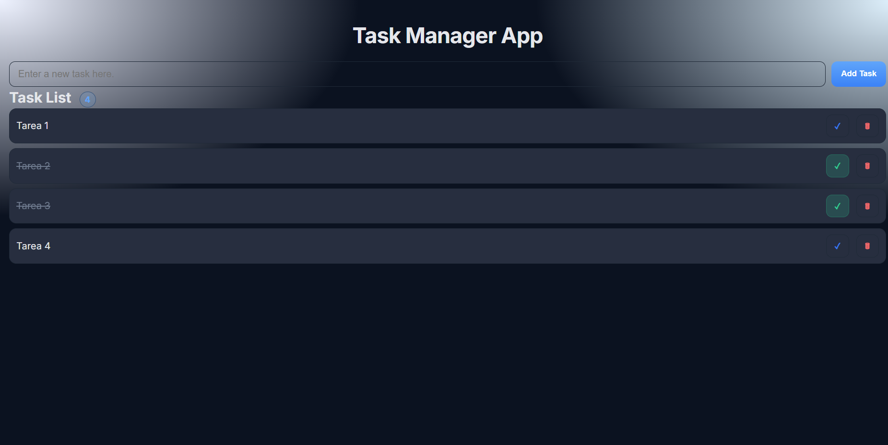

<h1 align="center">🗂️ Task Manager App</h1>
<p align="center">
  <em>Lista de tareas minimalista, accesible y sin dependencias — HTML + CSS + JavaScript</em>
</p>

<p align="center">
  
  
  
  
</p>

---

## ✨ Descripción
**Task Manager App** permite **añadir**, **marcar como completadas** y **eliminar** tareas.  
Incluye **persistencia** con LocalStorage, **contador** de tareas y **feedback accesible** (región `aria-live` con `role="status"`).  
Funciona con **HTML/CSS/JS vanilla** y se abre con doble clic (no requiere servidor).

---

## 📓 Tabla de Contenidos
- [Estructura del proyecto](#-estructura-del-proyecto)
- [Demo](#-demo)
- [Cómo ejecutar](#-cómo-ejecutar)
- [Estado actual](#estado-actual)
- [Posibles mejoras](#posibles-mejoras-del-proyecto)
- [Licencia](#-licencia)

---

## 📦 Estructura del proyecto

```text
PEC1/
├─ index.html
├─ style.css
├─ app.js
├─ docs/
│  └─ demo.png
├─ LICENSE
└─ README.md

```
---

## 📸 Demo
<p align="center">
  
</p>

---

## 🚀 Cómo ejecutar
1. **Descarga o clona** el repo.  
2. Abre `index.html` con doble clic.  
3. Escribe una tarea y pulsa <kbd>Enter</kbd> (o clic en **Add Task**).

> Opcional: servir localmente
```bash
# Python 3
python -m http.server 8080

# Node
npx serve .
```
---

## ✅ Estado actual

- [x] Interfaz básica (input, botón **Add Task**, lista)
- [x] Plantilla con `<template>` para cada `<li>`
- [x] Añadir tareas (validación: no vacías / `trim`)
- [x] Completar / descompletar (delegación de eventos)
- [x] Eliminar tareas (con gestión de foco)
- [x] Contador de tareas (badge junto al título)
- [x] Persistencia con **LocalStorage** (hidratar + guardar en cambios)
- [x] Accesibilidad base (label, `role="status"`, `aria-live`, `aria-pressed`)
- [x] Estilo visual “pro” (foco visible, hover, estado completado)
- [x] README y LICENSE (MIT)
- [x] Imagen de demo (`docs/demo.png`) y referencia en el README

---

## 🎯 Posibles mejoras del proyecto

- [ ] **Edición inline** de tareas  
  Permitir editar el texto de una tarea (doble clic o botón “Editar”), con confirmación (Enter) y cancelación (Esc).  
  - Recomendado: crear un `<input>` temporal en lugar de `contenteditable`.
  - Accesibilidad: `aria-label="Editar tarea"`, foco en el campo al activar la edición.

- [ ] **Filtros** (Todas / Pendientes / Completadas)  
  Añadir 3 botones o un `<select>` que apliquen una vista filtrada sin perder el estado interno.  
  - Sugerencia: no mutes `state.tasks`, solo filtra en el render.

- [ ] **Búsqueda rápida** (opcional)  
  Input que filtra por texto en tiempo real (coincidencia parcial, case-insensitive).

- [ ] **Sincronización entre pestañas** (opcional)  
  Escuchar `window.addEventListener('storage', ...)` para re-render cuando cambie el LocalStorage en otra pestaña.

- [ ] **Accesibilidad avanzada (A11y)**  
  - Mensajes de error/validación asociados con `aria-describedby`.  
  - Roles/labels en controles de filtro/edición.  
  - Navegación 100% con teclado (pruebas con `Tab`, `Enter`, `Espacio`, `Esc`).

- [ ] **Tests** (opcional)  
  - Unitarios con Jest (@testing-library/dom) para: añadir, completar, eliminar, persistencia.  
  - Smoke test de render inicial.

- [ ] **Despliegue** (opcional recomendado)  
  GitHub Pages desde rama `gh-pages` o “Pages” en `develop/main`. Verifica rutas relativas de `docs/demo.png`.

- [ ] **Memoria en PDF**  
  1–3 páginas: objetivo, requisitos cubiertos, decisiones técnicas (template, delegación, LocalStorage), accesibilidad, problemas/soluciones, mejoras futuras.

---

[](LICENSE)

